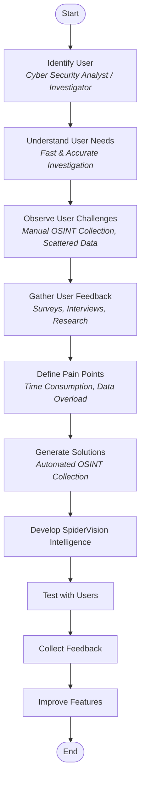

# Empathy Process Flow - SpiderVision Intelligence

**Topic Name:** Unique Characteristic of Design Thinking - Empathy Process Flow

## Product Selected
**SpiderVision Intelligence** – Social Media Threat Intelligence Platform

## Product Features
- OSINT Data Collection
- Social Media Profile Analysis
- Threat Detection
- Fake Profile Identification
- Intelligence Report Generation
- Dashboard Visualization

## Empathy Process Flow (Flowchart)

